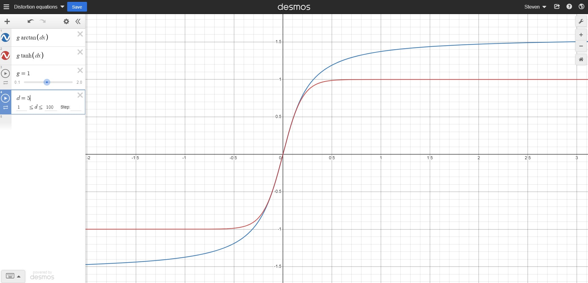

# Links
1. https://www.dafx12.york.ac.uk/papers/dafx12_submission_45.pdf
2. https://www.youtube.com/watch?v=_0ys155xv1Q
3. https://www.dsprelated.com/freebooks/pasp/Nonlinear_Distortion.html
4. https://www.dsprelated.com/freebooks/mdft/Alias_Operator.html
5. https://en.cppreference.com/w/cpp/io/cerr
6. https://www.programiz.com/c-programming/library-function/string.h/strcmp
7. https://en.cppreference.com/w/cpp/container/unordered_map
8. DAFX: Digital Audio Effects Second Edition - Udo Zölzer: https://picture.iczhiku.com/resource/eetop/sykfGloQfYJRZBcv.pdf
9. https://kidpatel.wixsite.com/dspaudioeffects/distortion

# Distortion Equations
Distortion Equations Graph 1:
https://www.desmos.com/calculator/dxdjbp8qgc

# Filters
## antiAliasingLowQuality:

Anti Aliasing FIR Filter Low Quality

FIR filter designed with
http://t-filter.appspot.com

sampling frequency: 44100 Hz

* 0 Hz - 10000 Hz
  gain = 1
  desired ripple = 5 dB
  actual ripple = 3.931638920952267 dB

* 11025 Hz - 22050 Hz
  gain = 0
  desired attenuation = -40 dB
  actual attenuation = -40.505116882329084 dB

## antiAliasingMediumQuality:

Anti Aliasing FIR Filter Medium Quality

FIR filter designed with
http://t-filter.appspot.com

sampling frequency: 44100 Hz

* 0 Hz - 10000 Hz
  gain = 1
  desired ripple = 1 dB
  actual ripple = 0.6743043737447633 dB

* 11025 Hz - 22050 Hz
  gain = 0
  desired attenuation = -60 dB
  actual attenuation = -60.94654043925138 dB

## antiAliasingHighQuality

Anti Aliasing FIR Filter High Quality

FIR filter designed with
http://t-filter.appspot.com

sampling frequency: 44100 Hz

* 0 Hz - 10000 Hz
  gain = 1
  desired ripple = 0.1 dB
  actual ripple = 0.07172997482872964 dB

* 11025 Hz - 22050 Hz
  gain = 0
  desired attenuation = -60 dB
  actual attenuation = -60.239146533981355 dB
